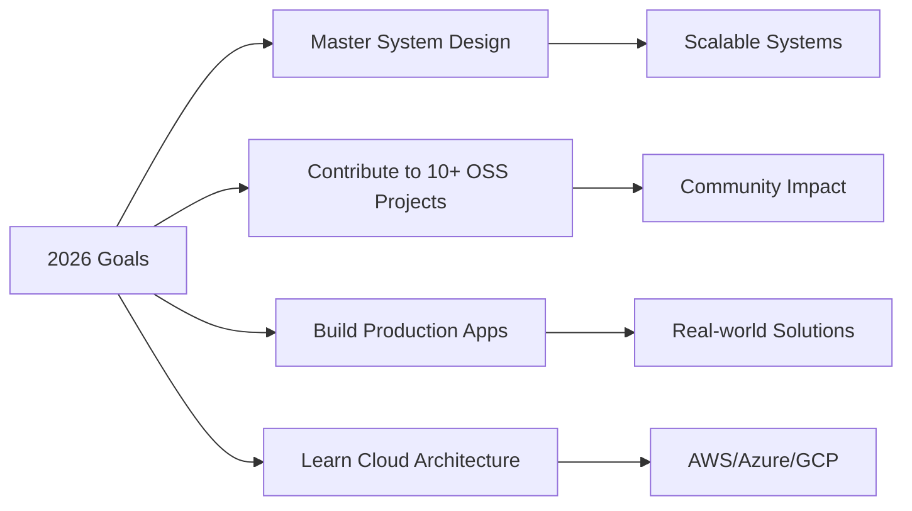

<div align="center">
  
  

  [](https://git.io/typing-svg)
  
  [](https://www.linkedin.com/in/Pawan8538/)
  [](mailto:pawanpatidar8538@gmail.com)
  [](#)

</div>

---

##  About Me

```typescript
const pawan = {
    location: "Indore, India 🇮🇳",
    role: "Full-Stack Developer",
    currentFocus: "Building scalable applications with MERN Stack",
    achievements: ["SIH 2025 Finalist ", "Open Source Contributor "],
    learning: ["System Design", "Cloud Architecture", "DevOps", "Agentic AI"]
};
```


### What I'm Up To

-  Working on **GIRAKSHA** - AI-based Mine Safety System (SIH 2025)
-  Exploring **System Design** & **Microservices Architecture**
-  Contributing to **Open Food Facts** and other open-source projects
-  Ask me about **React**, **Node.js**, **MongoDB**, **Next.js**
-  Building high-performance web applications with modern tech stacks

<br clear="right"/>

---

##  Tech Stack

<div align="center">

###  Languages


###  Frontend


###  Backend


###  Databases


###  Tools & Platforms


</div>

---

##  GitHub Statistics

<div align="center">
  
  

</div>

---

##  GitHub Trophies

<div align="center">
  
  

</div>

---


###  Highlighted Work

<table align="center">
  <tr>
    <td width="50%">
      <h3 align="center"> GIRAKSHA - Mine Safety System</h3>
      <div align="center">  
        <a href="https://sih-web-app-pcgw.onrender.com" target="_blank">
          
        </a>
        <a href="https://github.com/Pawan8538/Giraksha" target="_blank">
          
        </a>
        <p><strong>Next.js • Node.js • Socket.IO • ML • Fast API • PostgreSQL</strong></p>
        <p> SIH 2025 Finalist - AI-based comprehensive safety monitoring system for mining operations with real-time alerts and predictive analytics.</p>
      </div>
    </td>
    <td width="50%">
      <h3 align="center"> StayFinder</h3>
      <div align="center">
          <a href="https://https://stayfinder-1-zi3a.onrender.com.com" target="_blank">
          
        </a>
        <a href="https://github.com/Pawan8538/StayFinder" target="_blank">
          
        </a>
        <p><strong>React.js • Express.js • Search Algorithms</strong></p>
        <p> High-performance hotel search engine with sub-second retrieval using advanced Builder/Filter patterns.</p>
      </div>
    </td>
  </tr>
  <tr>
    <td width="50%">
      <h3 align="center"> Bookstore E-Commerce</h3>
      <div align="center">
        <a href="https://bookstore-gsr9.onrender.com/user/role" target="_blank">
          
        </a>
        <a href="https://github.com/Pawan8538/bookstore" target="_blank">
          
        </a>
        <p><strong>Node.js • Express • MongoDB</strong></p>
        <p> Full-stack book selling platform with user authentication, shopping cart, and payment integration.</p>
      </div>
    </td>
    <td width="50%">
      <h3 align="center"> Gemini AI Chatbot</h3>
      <div align="center">
        <a href="https://gemini-chatbot-jp7q.onrender.com/api/chat" target="_blank">
          
        </a>
        <a href="https://github.com/Pawan8538/gemini-chatbot" target="_blank">
          
        </a>
        <p><strong>Express.js • Google Gemini API</strong></p>
        <p> AI-powered customer support chatbot with emotion-based responses and session management.</p>
      </div>
    </td>
  </tr>
</table>

---

##  Open Source Contributions

<div align="center">

[](https://github.com/openfoodfacts/openfoodfacts-server)

</div>

###  Contribution Highlights

-  **Open Food Facts Server**: Fixed critical UI layout shifts and improved grid responsiveness
-  **Internationalization**: Optimized i18n configurations for better localization
-  **Responsive Design**: Enhanced mobile and desktop user experience
-  **Bug Fixes**: Resolved critical issues affecting user interface and functionality

<div align="center">

```
Pull Requests: 5+  |  Issues Resolved: 3+ 
```

</div>

---

## 📈 Contribution Activity

<div align="center">


</div>

---

##  Skills Matrix

<div align="center">

| **Category** | **Skills** | **Proficiency** |
|:---:|:---:|:---:|
| **Frontend** | React, Next.js, Redux, Tailwind CSS | ████████░░ 80% |
| **Backend** | Node.js, Express, REST APIs | ████████░░ 85% |
| **Database** | MongoDB, PostgreSQL, MySQL | ███████░░░ 75% |
| **DevOps** | Git, Docker, Linux | ██████░░░░ 65% |
| **AI/ML** | Python, TensorFlow, ML Basics | █████░░░░░ 55% |

</div>

---

##  Current Goals

<div align="center">



</div>

---

##  Let's Connect!

<div align="center">
  
  <a href="mailto:pawanpatidar8538@gmail.com">
    
  </a>
  <a href="https://www.linkedin.com/in/Pawan8538/">
    
  </a>
  <a href="https://github.com/Pawan8538">
    
</div>

---

<div align="center">


<div align="center">


<div align="center">

###  Profile Details


</div>

---

<div align="center">

  

  **⭐ From [Pawan8538](https://github.com/Pawan8538) **

</div>
